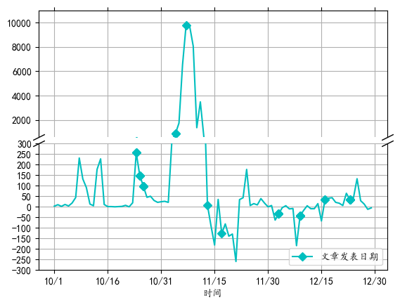

#### Table of Contents
{: .no_toc .text-delta }

- 1
- 2
- 3
- 4
- 5
- 6
{:toc}

## Statistics & Analyses

In this part, I will study on the relationships of subscriptions and the articles. Moreover, I will use some fomulas to quantify the efficiency of propaganda.

### The Number of Followers vs Day


From the figure, we can see that the subscription number increased raplidly from 31.Oct to 14.Nov. To get more precise result, we need to have a closer look.

### Daily Variation of the Number of Followers.



From this figure, we can find :

- Before 12.Nov, the articles attract more people to subcscribe this channel.
- However, after 12.Nov daily increasing subscription of this channel is lower than 0. We can state that the articles published after 12.Nov much less attractive than the earlier articles.

To quantify the attraction of the articles, we use reading rate. 
```
reading rate = view number / subscription number.
```
- The average reading rate of articles after 12.Nov is 0.056
- The average reading rate of articles before 12.Nov is 0.136
- The articles before 12.Nov is much more attractive than articles after 12.Nov

# Explanation and Results
The tag of articles before 12.Nov and after 12.Nov are quite similar, while the latter articles are less attractive. That's because the old users who focus on covid pandemic all subscribe this officail account and get to saturation. So to make articles more attractive to new users. This official account should push articles whose topic is concerned by people in JinShan community. We will discuss this later in the [Content](https://goooooooooooogle.github.io/just-the-docs-template/Contents.html) Chapter.


