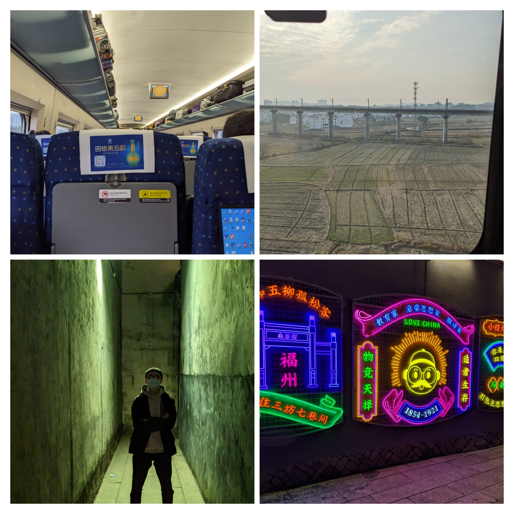
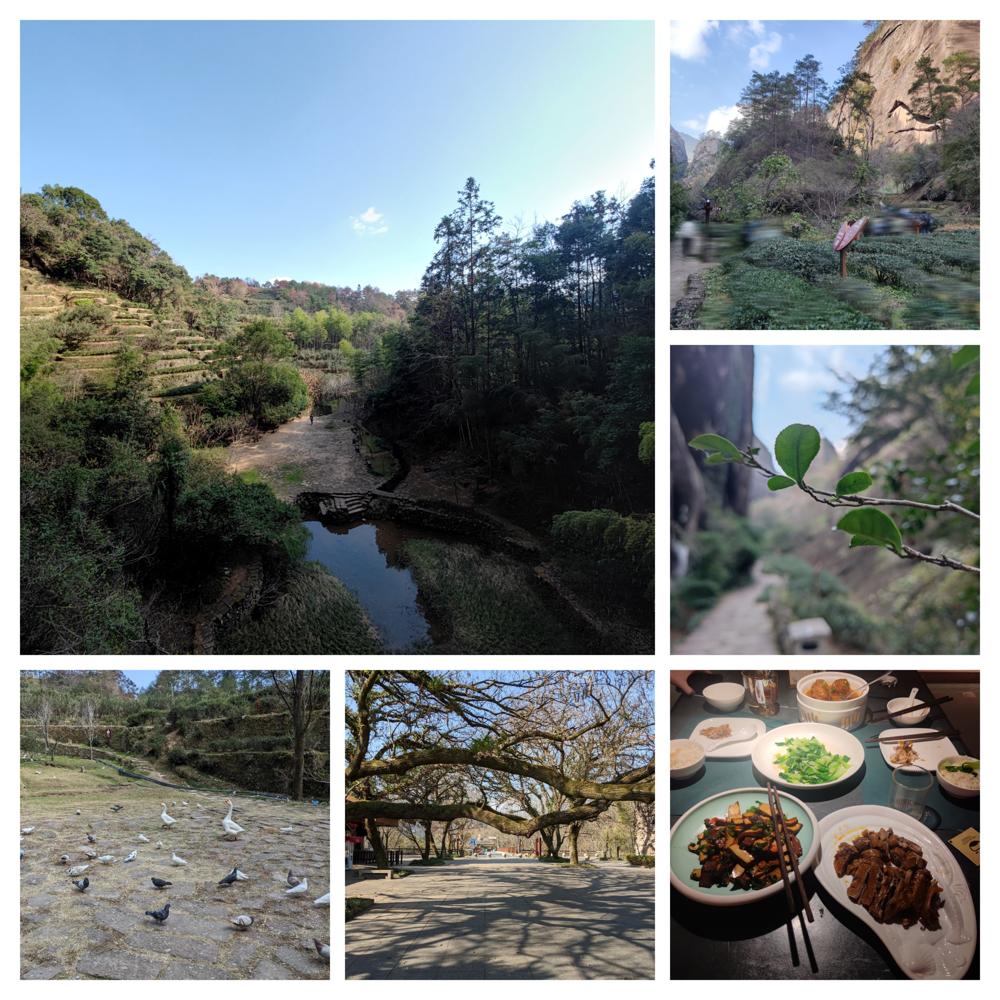
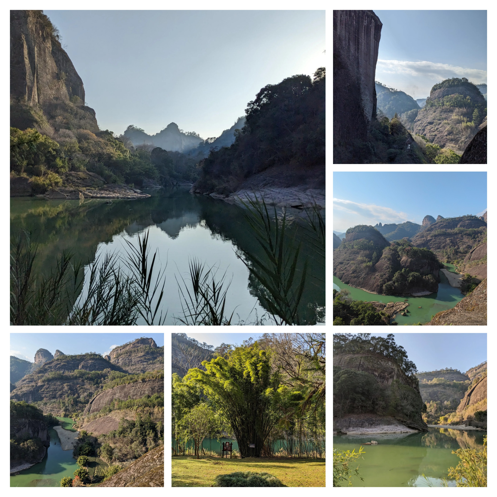
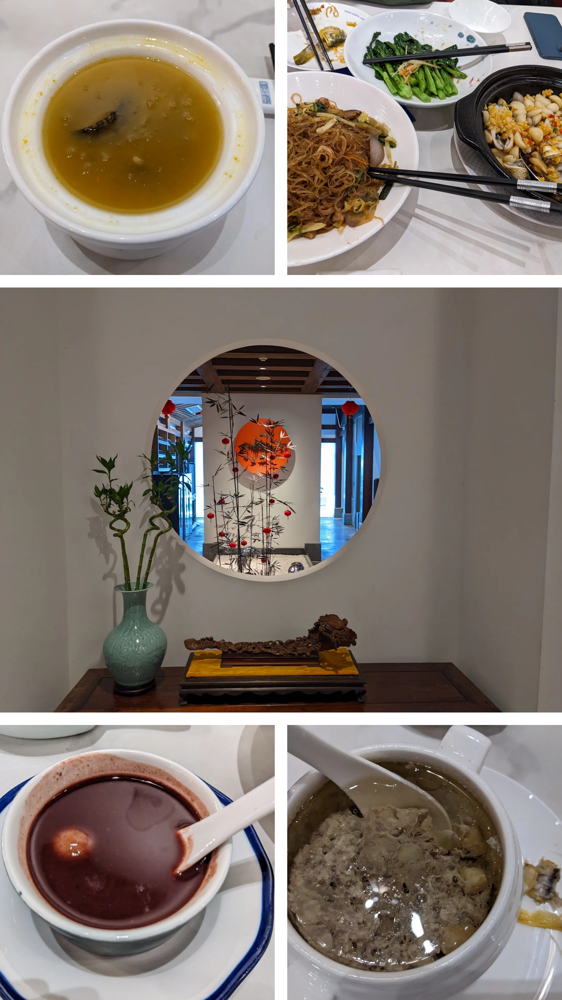
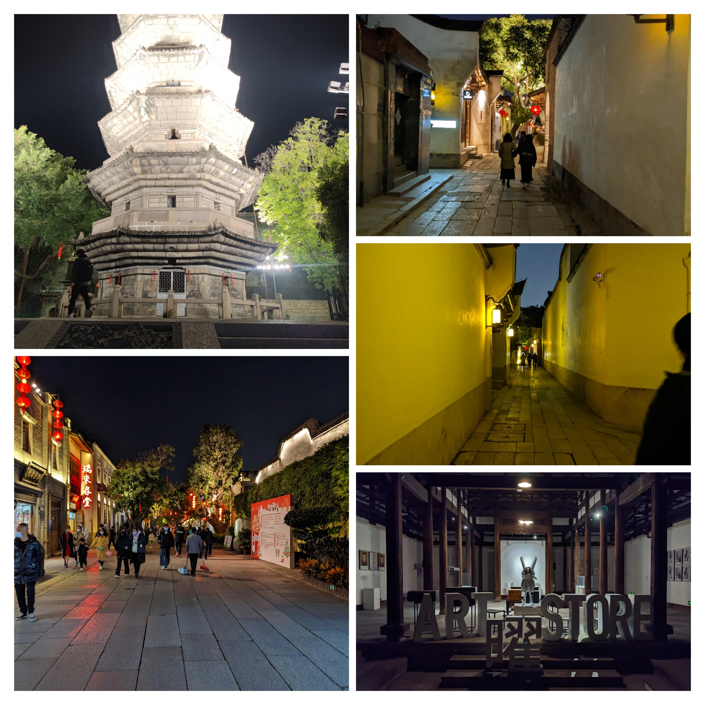
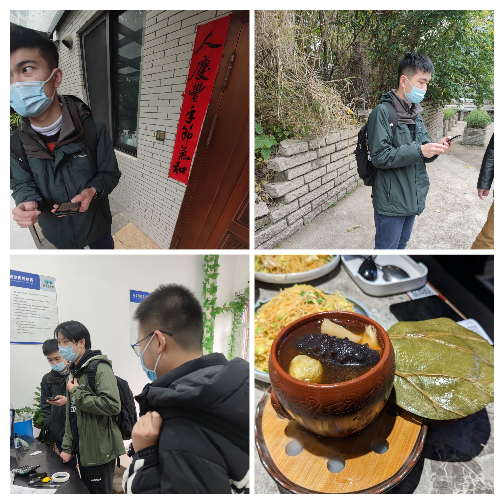
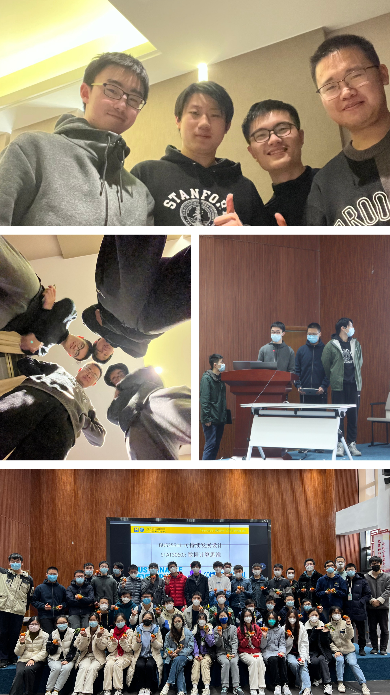
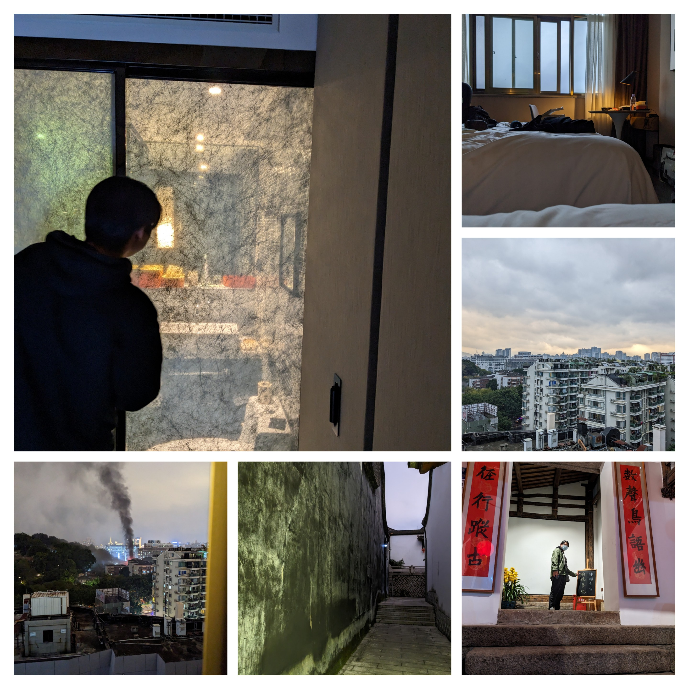
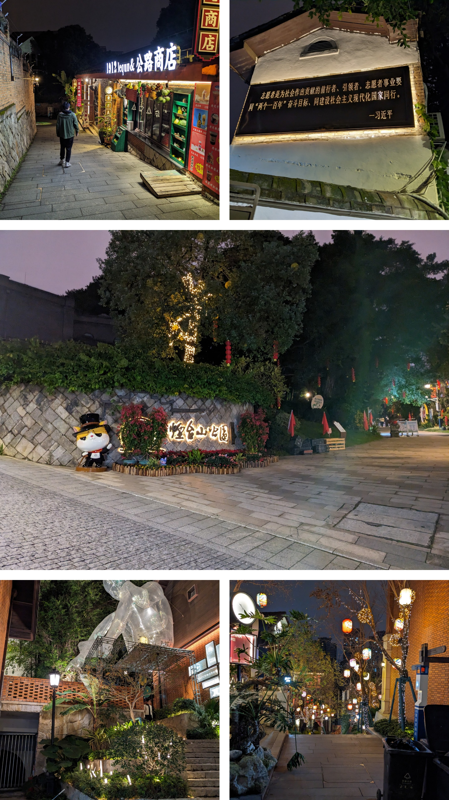

#### Table of Content:
{: .no_toc .text-delta }

- 1
- 2
{:toc}
---

# Contributors (in random order)
- Wang Runqiu 王润秋 
  - email: helloworldwrq@sjtu.edu.cn
- Du Yi 杜易
  - email: kaneki993@sjtu.edu.cn
- Lin Zixiang 林子翔
  - email: linzixiang@sjtu.edu.cn
- Yang Cheng 杨程
  - email: Lmir_YC@sjtu.edu.cn

# Division of Labour

## Wang Runqiu
- Took change of creating the website
- Completed the `Channel` part
- Got data of the account and reorganised them
- Drew figures of `Followers` part

## Du Yi
- Completed `Followers` part
- Completed `Conclusions & Prospect` part
- Proposed the title and lead-in part

## Lin Zixiang
- Completed `Functions` part
- Contributed to slides for presentation
- Created questionaires and provided their results

## Yang Cheng
- Completed `Contents` part
- Contributed to slides for presentation
- Got data from other communities

## All of 4 Members
- Participated in all activities
- Came up the topic after sufficient discussions
- Participated in the presentation
- Interviewed residents while doing offline surveys and investigations
- Enjoyed the trip

# Our Winter Program 

