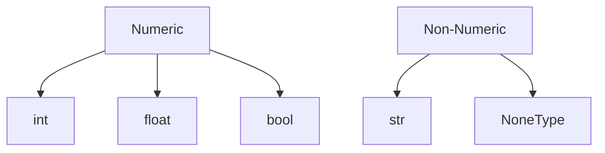
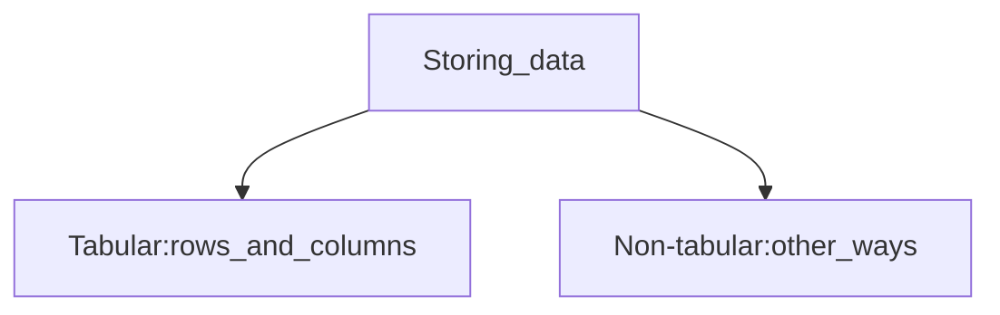
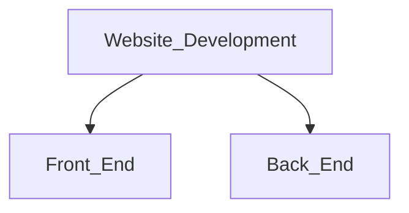
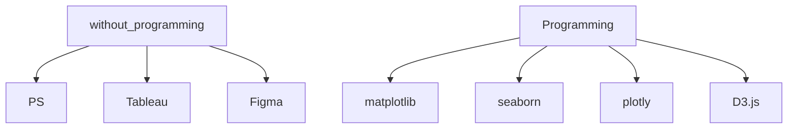

# Lecture 1

## Basics

- operands & arguments &return values

- value of last expression is shown `out`

- name: descriptive `seconds_per_hour`

- Jupyter memory model

- save & restart kernel: `kernel-Restart & Clear Output`

## Types



- check type: `type(x)`

- **string**
  
  - `''` & `""` both acceptable
  
  - length check `len('junior')` ->6
  
  - `empty=""` length is 0
  
  - concatenation is supported `'cheer '+'up'`
  
  - use `\` to break a line
  
  - `"3"*4` is 3333, while the latter can't be float
  
  - string containment `'Fuzhou' in 'city of Fuzhou'` is `True`

- **type casting** 
  
  - `int(x)` : input a float: return x as a int (cuts off decimal), str: must contain a int
  
  - `str(13+15/2)`  returns `'20.5'`

- NoneType: only value -- None
  
  - can't be displayed, but can be printed
  
  - define: `my_var=None`
  
  - `strange=print(15)` `strange` is a `NoneType`

- boolean operators
  
  - `and` True only all are Ture
  
  - `or` True when one True
  
  - `not` (!)

- bool
  
  - `bool('')` False
  
  - `bool(None)` False
  
  - `bool(0)` False
  
  - others(Generally things are not empty) are True including `bool(-1e15)`: a **truthy value**, otherwise a **falsy value**

## Functions

```python
def ready_to_graduate(year,units):#2 parameters
    return (year=='senior') and (units>=120)#use indentation

ready_to_graduate('senior',121)#True, 2 arguments
```

- zero parameter is acceptable

- ```python
  N=15
  def addN(x):
      return x+N#look out to find the value of N
  def add(N):
      return N+1#also acceptable
  ```

- no `return`: return `None`

## Methods

- `'issac'.upper()` is evalueated to `'ISSAC'`

- string methods
  
  - upper
  
  - lower
  
  - `'hi'.replace('i','iii')` is `'hiii'`

## If statements

```python
if <boolean expression>:
    <if body>
elif <boolean expression>:
    <else if body>
else:
    <else body>
```

## While loops

```python
while <boolean expression>:
    <while body>
```

## For loops

```python
for <elem> in <sequence>:
    <for body>
```

- ```python
  for n in [2,4,6,8]:#can be a variable e.g. l=[2,4,6,8]
      print(n*5)
  ```
  
  prints 10 20 30 40

- ```python
  for char in 'university':
      print(char.upper())
  #U
  #N
  #...
  ```

- ```python
  for j in range(10):#0 to 9
      print(j)
  list(range(n)) #convert to a list of int from 0 to n-1
  range(3,5)#3,4
  
  for n in range(3,11,2):
      total+=n
  #3+5+7+9
  ```

- adding list: `list_add([1,2,3],[4,5,6])` is [5,7,9]

---

# Lecture 2

## Dictionaries

```python
dog={'name':'Junior',
    'age':11,
    4:['kibble','treat']}
```

key-value pairs

`dog[name]` is `Junior`

### add new value

```python
slang={}
slang['btw']='by the way'
```

- keys must be unique

- lists and dictionaries are **collections**

### Get

- length `len(slang)`

- a list of keys`list(slang.keys())` (also do this to get values)

- get a bool: `'smg in slang'`

### iteration


### replacement

```python
#replace every abbreviation
def replace_slang(text):
    for abb in more_slang.keys():
        if abb in text:
            text=text.replace(abb,more_slang[abb])
    return text
```

## File formats



- `CSV` comma-separated values
  
  - tabular

`JSON` JavaScript Objsct Notation

- very similar to python

## Modules

import `modules` to add functioanlity

- math and data analysis: `numpy`

- tabular data: `pandas`

- reading JSON: `json`

- visualizations: `matplotlib.pyplot, seaborn, plotly`

### Import

```python
from <module name> import *
import <module name> as <nickname>
```

## Numpy

```python
import numpy as np
```

- arrays
  
  - type: `numpy.ndarray`
  
  - `np.array([])`
  
  - `np.array([4,9,1,2])`
  
  - it's a function

- opperations on every element
  
  - `numers_arr * 2`
  
  - convenient!

- others: `np.log` `np.sqrt` `np.sin`

- Element-wise operations: computed element-wise
  
  - `np.array([1,2,3])+np.array([4,5,6])` is `[5,7,9]`

- other features
  
  - ```python
    import numpy as np
    #accessing
    nums=np.array([1,2,3])
    nums[0] #1
    nums.item(0) #1
    nums[-1] #3
    #common methods
    nums.sum()
    nums.mean()
    nums.prod()# product of all elem
    #ranges
    np.range(10)#array([0, 1, 2, 3, 4, 5, 6, 7, 8, 9])
    np.arange(3,13,3)
    2**np.arange(10)#array([1,2,4,8,16,32,64,128,256,512])
    ```
  
  - automatic type conversion: all elemets are in the same type
  
  - cumulative sum: add elements so far `np.cumsum(nums)`
  
  - difference: take differences between elements `np.diff(nums)` 
  
  - count the number of elements that are not equal to 0: `np.count_nonzero(np.array([1,2,3,0,0,4,-5]))`

# lecture 3

## Creat a website



# Lecture 4- create a website

# Lecture 5

## Visualization

### Variable types


### Tools



### Plotly

- [documentation](https://plotly.com/python/plotly-express/)


---

# Problems

## elements

- 内容

- 标题与封面

- 公众号用户（年龄，性别，区域，习惯

- 菜单（你呼我应，便民服务，发热诊室

- 关键词

## questions

1. 用户画像
   
   - 年龄，性别，生活习惯，使用习惯（菜单数据，消息数据）

2. 传播途径分析
   
   - followers - 转化率
   
   - 转发（群、朋友圈、私聊）- 转发率，转化率
   
   - 线下：扫码、口头

3. 公众号每篇消息带来的用户增长
   
   - 增长较多的原因
   
   - 增长较少的原因
   
   - 最佳发送时间

4. 拓展业务到其他平台
