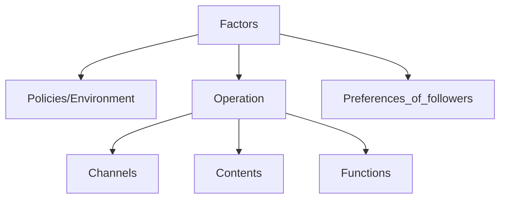

#### Table of Contents
{: .no_toc .text-delta }

- 1
- 2
- 3
- 4
- 5
- 6
{:toc}

# A Discussion on Factors Influencing Subscription of WenXuJinShan Official Account during Pandemic Era from Multiple Perspectives
{: .no_toc }
- STAT3060J Computational Thinking with Data (2023 WP)

## Brief Introduction
In this project, we are going to use tools like python to analyse data of WenXuJinShan official account. And try to find a practicable way to optimize 
the function of this official account. Besides function optimization, we also attempt to propose some suggetions that can help this official account 
attract more subscription.

### Perspectives that We Concern
- Dissemination channels
- The relationship between article's topic and its attraction
- The function of WenXuJinShan official account
- The users' preferences of articles' contents

### Why these?
Let's take a closer look at factors to the number of followers.

`Preferences_of_followers` `Functions` `Contents` `Channels` are four factors that can be easily quantified. Also, these can be analysed through our data.

### Various Approaches
- questionaire
- use python to analyze the data of this official account
- some useful formula from previous paper.
- field visit

This website presents our final results.
- [Click here to access our slides for presentation](https://github.com/goooooooooooogle/just-the-docs-template/blob/main/files/Team2_Pre_final.pptx)
- [Click here to access our Github repository](https://github.com/goooooooooooogle/just-the-docs-template)
- [Contact us](https://goooooooooooogle.github.io/just-the-docs-template/about.html)
- [Click here to access our code](https://github.com/goooooooooooogle/just-the-docs-template/tree/main/code)
