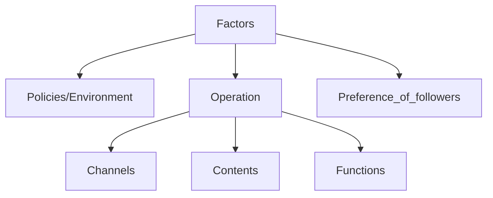

- 1
- 2
- 3
- 4
- 5
- 6
{:toc}

# 2023 WP data analysis—A Discussion on factors influencing subscription of WenXuJinShan official account during pandemic era from multiple perspectives

## Brief introduction
In this project, we are going to use tools like python to analyse data of WenXuJinShan official account. And try to find a practicable way to optimize 
the function of this official account. Besides function optimization, we also attempt to propose some suggetions that can help this official account 
attract more subscription
### Here are the perspectives we concern.
- The relationship between article's topic and its attraction.
- The function of WenXuJinShan official account.
- The users' preference of articles content.

### Why these?
Let's take a look at factors to the number of followers.

### To do these research we use various ways like:
- questionaire
- use python to analyze the data of this official account
- some useful formula from previous paper.
- field visit
This website presents our final results.
